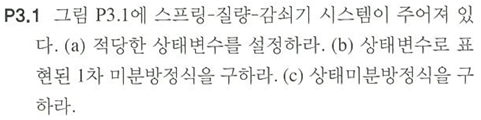
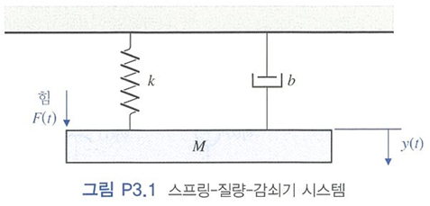
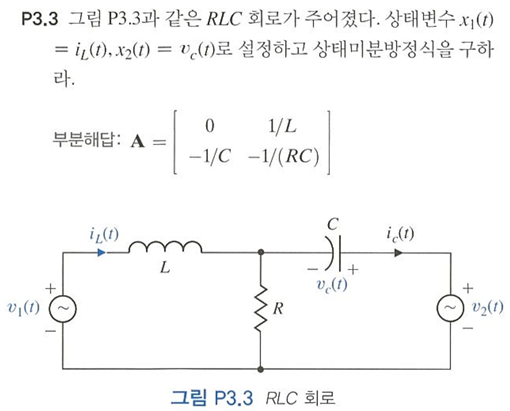
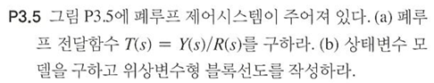
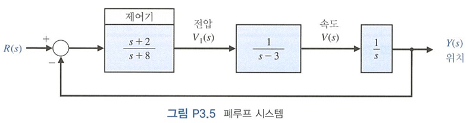
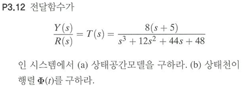
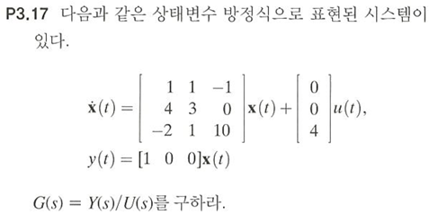

# 2023732036 강민주 제어공학1 과제

---

## P3.1

### (a)
* $x_1(t)=y(t)$  
* $x_2(t)=dx_1(t)/dt=dy(t)/dt$  
### (b)
뉴턴의 제2법칙을 적용하여 운동방정식을 세운다.  
$$M(d^2y(t)/dt^2)+b(dy(t)/dt)+ky(t)=F(t)$$  
위의 식에 (a)에서 정의한 상태변수를 대입한다.  
$$dx_2(t)/dt=-b/M(x_2(t))-k/M(x_1(t))+F(t)/M$$  
$$dx_1(t)/dt=x_2(t)$$
### (c)
상태미분방정식은
$$\dot{\mathbf{x}}(t)=\mathbf{A}\mathbf{x}(t)+\mathbf{B}\mathbf{u}(t)$$
$$\mathbf{y}(t)=\mathbf{C}\mathbf{x}(t)+\mathbf{D}\mathbf{u}(t)$$ 와 같은 형식이므로  
$$\dot{\mathbf{x}}(t)=\begin{bmatrix}0&1\\k/M&-b/M\end{bmatrix}\mathbf{x}(t)+\begin{bmatrix}0\\1/M\end{bmatrix}\mathbf{F}(t)$$  
$$\mathbf{y}(t)=\begin{bmatrix}1&0\end{bmatrix}\mathbf{x}(t)$$이다.  

---

## P3.3

이 회로의 system을 파악하기 위해 KCL, KVL을 통해 관계식을 얻는다.
* KVL(전체 loop)  
$$v_1(t)-v_2(t)=L(di_L(t)/dt)-v_c(t)$$
* KCL(RLC 모두 연결되는 node)  
$$i_L(t)+C(dv_c(t)/dt)=i_R(t)$$  
* KVL(오른쪽 loop)  
$$i_R(t)=(-v_c(t)+v_2(t))/R$$  
위의 식을 $$i_L(t)+C(dv_c(t)/dt)=i_R(t)$$에 대입하면  
$$i_L(t)+C(dv_c(t)/dt)=(v_2(t)-v_c(t))/R$$이다.  
$$v_1(t)-v_2(t)=L(di_L(t)/dt)-v_c(t)$$과 $$i_L(t)+C(dv_c(t)/dt)=(v_2(t)-v_c(t))/R$$를 주어진 상태변수로 정리하면 다음과 같다.  
$$dx_1(t)/dt=(1/L)x_2(t)+(1/L)v_1(t)-(1/L)v_2(t)$$
$$dx_2(t)/dt=-(1/C)x_1(t)-(1/RC)x_2(t)+(1/RC)v_2(t)$$  
상태미분방정식은 다음과 같다.  
$$\mathbf{x}(t)=\begin{bmatrix}x_1(t)\\x_2(t)\end{bmatrix}$$  
$$\mathbf{v}(t)=\begin{bmatrix}v_1(t)\\v_2(t)\end{bmatrix}$$  
$$\dot{\mathbf{x}}(t)=\begin{bmatrix}0&1/L\\-1/C&-1/RC\end{bmatrix}\mathbf{x}(t)+\begin{bmatrix}1/L&-1/L\\0&1/RC\end{bmatrix}\mathbf{v}(t)$$  

---

## P3.5

### (a)
우선 폐루프에서의 전달함수에 관해 알아야 한다. 입출력 사이의 전달함수를 $$G(s)$$, 피드백 전달함수를 $$H(s)$$라고 하면 $$T(s)=G(s)/(1+G(s)H(s))$$이다.  
$$H(s)=1$$이고 $$G(s)=(s+2)/(s*(s-3)*(s+8))$$이므로 
$$T(s)=(s+2)/(s^3+5s^2-23s+2)$$
### (b)
$$\mathbf{A}=\begin{bmatrix}0&1&0\\0&0&1\\-a_0&-a_1&-a_2\end{bmatrix}$$  
$$\mathbf{B}=\begin{bmatrix}0\\0\\0\\1\end{bmatrix}$$  
$$\mathbf{C}=\begin{bmatrix}b_0&b_1&b_2\end{bmatrix}$$  
$$\mathbf{D}=0$$  
$$a_2=5, a_1=-23, a_0=2$$이고 $$b_2=0, b_1=1, b_0=2$$이므로 이를 위 matrix에 대입하여 state space equation을 표현하면 다음과 같다.  
$$\dot{\mathbf{x}}(t)=\begin{bmatrix}0&1&0\\0&0&1\\-2&23&-5\end{bmatrix}\mathbf{x}(t)+\begin{bmatrix}0\\0\\1\end{bmatrix}\mathbf{r}(t)$$  
$$\mathbf{y}(t)=\begin{bmatrix}2&1&0\end{bmatrix}\mathbf{x}(t)$$  

---
## P3.12

P3.12의 문제에서 state transition matrix을 구해야한다. $\Phi(s)=\begin{bmatrix}sI-A\end{bmatrix}^{-1}$를 계산해야 하므로 이를 수식으로 계산하여 답을 구하는 대에는 굉장한 난이도가 있다. 그러므로 이 문제에서는 matlab코드를 markdown형식으로 표현하고 실행결과를 사진으로 업로드 하여 답을 도출하도록 한다.
### sol) (a)
<pre>syms s
[num]=sym2poly(8*s+5);
[dem]=sym2poly(s^3+12*s^2+44*s+48);
[A, B, C, D]=tf2ss(num, dem)</pre>
#### 실행결과
  
state space equation
$$\dot{\mathbf{x}}(t)=\begin{bmatrix}-12&-44&-48\\1&0&0\\0&1&0\end{bmatrix}\mathbf{x}(t)+\begin{bmatrix}1\\0\\0\end{bmatrix}\mathbf{r}(t)$$
$$\mathbf{y}(t)=\begin{bmatrix}0&8&5\end{bmatrix}\mathbf{x}(t)$$
### sol) (b)
 $\Phi(s)=\begin{bmatrix}sI-A\end{bmatrix}^{-1}$
<pre>Phi_s=inv(s*eye(3)-A)
Phi_t=ilaplace(Phi_s)</pre>
#### 실행결과
  

### 결과 검증
<pre>G_s=C*Phi_s*B-D;
[num, den]=numden(G_s)</pre>
#### 실행결과
  
문제의 transfer function과 state space equation을 통해 구한 transfer function과 동일.

---
## P3.17
  
P 3.12와 같은 이유로 matlab을 사용하여 문제를 풀이하겠음.
<pre>A=[1, 1, -1; 4, 3, 0; -2, 1, 10];
B=[0;0;4];
C=[1, 0, 0];
D=0;
[num,den]=ss2tf(A, B, C, D)</pre>
#### 실행 결과
  
